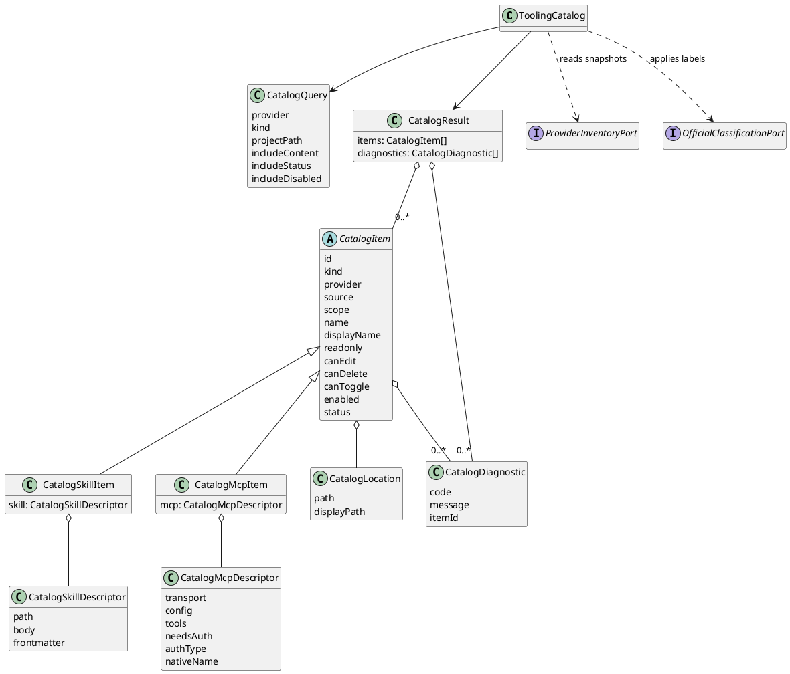
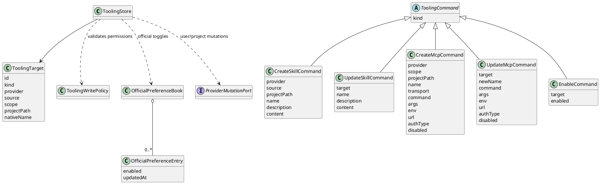
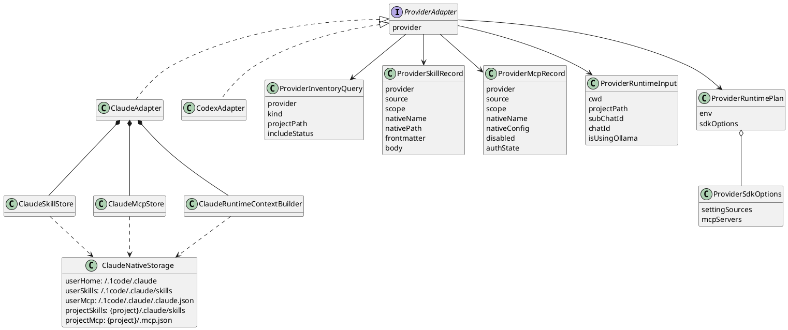

# Tooling 三层抽象技术实现文档

本文基于 `claude-skill-mcp-current-mechanism.md`，定义 1Code 后端侧统一 Skill/MCP 管理模块的实现方案。

目标是把当前散落在 `skills.ts`、`claude-config.ts`、`mcp-auth.ts`、`claude.ts` 和设置页中的 Skill/MCP 逻辑，逐步收敛到 `src/main/lib/tooling`。第一阶段实现 Claude，后续再接 Codex。

本文是技术实现设计，不是 OpenSpec proposal，也不直接开始编码。

## 1. 背景

当前 Claude Skill 与 MCP 是两套机制：

- Skill 通过目录发现，运行时由 Claude SDK 按 `CLAUDE_CONFIG_DIR` 加载。当前实现保持 `settingSources: ["project"]`，避免 Claude Code 2.1.45 在 SDK stream-json 模式下加载 user-level settings/plugins 时卡住；历史机制和理想态可以支持 `["project", "user"]`，但不能在没有验证的情况下直接恢复。
- MCP 通过多配置源合并，运行时由 1Code 组装 `options.mcpServers` 后显式传给 Claude SDK。

现状能工作，但有几个结构性问题：

- Skill/MCP 没有统一领域语言、边界 DTO 和清晰的模型隔离。
- 管理 API 和 provider 细节耦合在 tRPC router 里。
- UI 直接理解 `source === "plugin"`、`disabled`、provider 分流等底层语义。
- 官方内容、只读、启停、升级刷新没有统一抽象。
- 后续接 Codex 时容易继续复制 Claude 逻辑，形成第二套不一致实现。

因此需要新增一套后端 tooling 管理域。

## 2. 设计目标

### 2.1 目标

1. 统一 Skill/MCP 的后端领域语言、边界 DTO 和三层模型隔离规则。
2. 统一官方、用户、项目、插件四类来源的展示与操作语义。
3. 把 provider 差异收敛到 `ProviderAdapter`。
4. 第一阶段保持项目级目录和合并优先级不变，但将 Claude user-scope 切到 1Code 私有目录。
5. 后续支持官方预装、启停偏好、升级刷新和 Codex adapter。
6. 让 tRPC router 变薄，只负责参数校验和调用 tooling service。

### 2.2 非目标

第一阶段不做：

- 不重写 Claude SDK 调用链路。
- 不自动迁移或默认复用真实本机 `~/.claude*` 用户配置。
- 不迁移用户已有 Skill/MCP。
- 不引入 SQLite 索引保存所有 Skill/MCP。
- 不实现 Codex 完整 adapter。
- 不改前端大布局，只为后续 UI 统一模型做后端准备。

### 2.3 路径约定

Claude provider 的 1Code 用户级根目录固定为：

```text
~/.1code/.claude/
```

该目录是 1Code 自己的 Claude user-scope，不等同于用户本机 Claude Code 的 `~/.claude`。默认运行时和管理 UI 都不再读写真实 `~/.claude*`。

建议目录结构：

```text
~/.1code/.claude/
  skills/
  commands/
  agents/
  plugins/
  settings.json
  .claude.json
  mcp.json
```

约定：

- `skills/commands/agents/plugins/settings.json` 用于投影到 Claude runtime 的 `CLAUDE_CONFIG_DIR`。
- `.claude.json` 作为 1Code user-level MCP 的 canonical 写入文件，使用 root-level `mcpServers`。
- `mcp.json` 只作为后续兼容扩展预留，第一阶段不作为主要写入目标。
- 真实本机 `~/.claude*` 只作为显式导入来源，不作为默认读取或写入来源。

## 3. 核心原则

### 3.1 文件/配置仍是事实来源

第一阶段不把 Skill/MCP 全量落库。

原因：

- Skill 本来就是文件目录，用户可能绕过 1Code 直接编辑。
- MCP 仍是配置文件模型；user-scope 放在 `~/.1code/.claude/.claude.json`，project-scope 继续使用项目配置。
- 插件内容来自插件目录。
- 过早引入索引表会带来同步、失效、冲突和迁移成本。

因此：

- 用户/项目/插件 Skill/MCP 仍以原始文件或配置为事实来源，其中 Claude user-scope 的事实来源是 `~/.1code/.claude`。
- 1Code 只为官方内容、启停偏好、状态缓存保存自己的轻量文件。
- Catalog 每次按需读取并归一化，必要时做 mtime/cache 优化。

### 3.2 统一模型，不强行统一底层存储

统一的是后端返回模型和操作语义，不是强行把所有 provider 都改成同一种存储方式。

Claude Skill 仍读目录，user-scope 目录为 `~/.1code/.claude/skills`。

Claude MCP 仍读配置，user-scope canonical 配置为 `~/.1code/.claude/.claude.json`。

插件仍读插件目录。

官方内容不强制引入独立受管目录。Skill/MCP 的物理事实来源仍保持为 provider 用户级目录和项目级目录；官方归属、默认启用状态和升级期望由 1Code 管理层配置文件描述。

### 3.3 Adapter 负责 provider 细节

`ToolingCatalog` 和 UI 不应该知道：

- Claude user Skill 在 `~/.1code/.claude/skills`。
- Claude user MCP 写进 `~/.1code/.claude/.claude.json`。
- Claude runtime 需要 `CLAUDE_CONFIG_DIR`。
- Codex 使用 `CODEX_HOME`。

这些都属于 provider adapter 的责任。

## 4. 三层抽象

三层抽象不是“把 Skill/MCP 放进同一个统一实体里”，而是三个相互隔离的领域模型，也可以理解为三个 bounded context。每一层都有自己的实体、输入、输出和约束，层与层之间只通过边界 DTO、稳定 id、primitive 枚举或端口协议传递数据：

- `ToolingCatalog` 是读侧领域模型，关注“如何把各来源归一化成可展示、可搜索、可诊断的 item”。
- `ToolingStore` 是写侧领域模型，关注“哪些操作允许发生、写到哪里、如何保留用户偏好”。
- `ProviderAdapter` 是 provider 原生领域模型，关注“Claude/Codex 各自如何读写原生存储并准备 runtime context”。

这三层不能共享同一个 `ToolingItem` 作为“万能领域对象”。`ToolingItem` 只能作为 Catalog 对外返回的 API/UI 读 DTO；Store 只能接收命令和目标引用；ProviderAdapter 只能暴露 provider 原生记录和 runtime plan。

落地时也要按领域模型隔离文件和类型：

- Catalog 内部使用 `CatalogItem`/`CatalogQuery`/`CatalogProjection`，只在 router/API 边界映射成 `ToolingItem`。
- Store 内部使用 `ToolingCommand`/`ToolingTarget`/`WritePolicy`，不能把 `CatalogItem` 或 `ToolingItem` 当作写入依据。
- ProviderAdapter 内部使用 `ProviderSkillRecord`/`ProviderMcpRecord`/`ProviderRuntimePlan`，不能直接返回 UI 展示 DTO。
- `official-content.json`、`official-preferences.json`、`official-installed-state.json` 属于 1Code 管理域支撑数据，不属于 Catalog/Store/Provider 任意一层的内部实体。

| 层 | 领域模型 | 核心对象 | 对外边界 | 不能依赖 |
|---|---|---|---|---|
| Catalog | 读侧投影模型 | `CatalogItem`、`CatalogQuery`、`CatalogDiagnostic`、`CatalogProjection` | `ToolingItem` DTO、`ProviderInventoryPort` | 写命令、runtime 注入细节 |
| Store | 写侧命令模型 | `ToolingCommand`、`ToolingTarget`、`WritePolicy`、`OfficialPreferenceRef` | command API、`ProviderMutationPort`、`OfficialPreferenceBook` | UI 展示 item、provider 原生文件结构 |
| ProviderAdapter | Provider 原生模型 | `ProviderSkillRecord`、`ProviderMcpRecord`、`ProviderRuntimePlan`、`NativeStorageLayout` | provider adapter port、runtime plan | Catalog 分组策略、产品级官方策略 |

第 5 章只定义边界 DTO、枚举和映射规则，不定义第四个“大领域模型”。如果实现中发现某个类型同时被三层直接 import，它通常应该被拆成一份 shared primitive、一份 Catalog projection、一份 Provider record，或者一份 Store command。

### 4.0.1 领域隔离规则

实现时按下面的规则判断模型是否放错了层：

- `CatalogItem`、`CatalogSkillItem`、`CatalogMcpItem` 只能存在于 Catalog 读侧，不能被 Store 或 ProviderAdapter 作为入参。
- `ToolingCommand`、`ToolingTarget`、`WritePolicy` 只能存在于 Store 写侧，不能让 ProviderAdapter 理解 UI 分组、官方标签或编辑按钮状态。
- `ProviderSkillRecord`、`ProviderMcpRecord`、`ProviderRuntimePlan` 只能存在于 ProviderAdapter 原生侧，不能被 UI 直接消费。
- `ToolingItem` 是 API/UI DTO，不是三层内部领域实体；它应该由 Catalog projection 生成，不能反向驱动写入。
- `official` 相关文件是 1Code 管理支撑域。Catalog 可以读取它做归类，Store 可以写偏好，ProviderAdapter 可以在 runtime plan 中读取启停结果，但三层都不能把它当成自己的核心实体。

依赖方向约束：

```text
catalog | store | provider
  -> shared/primitives, shared/ids, shared/errors

catalog projection
  -> provider inventory port 返回的 provider snapshot
  -> official classification port 返回的官方归类结果

catalog/catalog-model
  -> shared/dto 只在 API 边界投影
  -> 不允许被 store/provider import

store/store-model
  -> 不允许被 catalog/provider 直接 import，除端口 target/ref 类型外

provider/provider-model
  -> 不允许 import catalog/store 内部模型

store
  -> 通过 ProviderMutationPort 调用 provider 写能力
  -> 不直接依赖 ProviderSkillRecord/ProviderMcpRecord 作为写入依据
```

PlantUML 也按领域隔离表达：Catalog、Store、ProviderAdapter 各自一张类图，不画一张包含三层所有实体的“大类图”。

## 4.1 ToolingCatalog

`ToolingCatalog` 是统一读模型层。

它回答：

> 当前 1Code 里有哪些 Skill/MCP？它们来自哪里，归哪个 provider，能不能编辑，是否启用，状态如何？

职责：

- 聚合不同 provider adapter 返回的 provider snapshot。
- 聚合官方 registry、插件发现、用户/项目配置。
- 归一化成 Catalog 自己的 `CatalogItem`，再作为 `ToolingItem` DTO 返回给 UI/API。
- 处理过滤、排序、分组、冲突标记。
- 给 UI 和 mention 系统提供稳定列表。

不负责：

- 不直接写文件。
- 不直接调用 Claude SDK。
- 不直接执行 MCP。
- 不保存全量索引。

### 4.1.1 Catalog 读侧领域模型类图



说明：

- Catalog 图只表达读侧聚合和归一化，不表达写入、启停持久化或 runtime 注入。
- `ProviderInventoryPort` 返回的是 provider snapshot，不是 Catalog item；Catalog 负责把 snapshot 投影成 `CatalogItem`。
- `OfficialClassificationPort` 在这里的职责是识别官方归属和默认启用状态，不负责写 preferences。
- ProviderAdapter 可以实现 `ProviderInventoryPort`，但 Catalog 不直接理解 Claude/Codex 的物理目录。

### 4.1.2 Catalog 输入

```ts
type ToolingCatalogQuery = {
  provider?: ToolingProvider | "all"
  kind?: ToolingKind | "all"
  projectPath?: string | null
  includeContent?: boolean
  includeStatus?: boolean
  includeDisabled?: boolean
}
```

### 4.1.3 Catalog 输出

```ts
type ToolingCatalogResult = {
  items: ToolingItem[]
  diagnostics: ToolingDiagnostic[]
}
```

## 4.2 ToolingStore

`ToolingStore` 是统一写模型层。

它回答：

> 用户要创建、更新、删除、启停一个 Skill/MCP 时，应该写到哪里？哪些来源允许写？哪些字段允许改？

职责：

- 封装创建、更新、删除、启停操作。
- 做权限判断，比如官方/插件只读。
- 把统一操作路由给对应 provider adapter。
- 维护 1Code 自己的轻量偏好文件。
- 保证写操作不会覆盖用户非目标配置。

不负责：

- 不负责展示分组。
- 不负责运行时注入。
- 不直接依赖 React/UI。

### 4.2.1 Store 写侧领域模型类图



说明：

- Store 图只表达写侧操作和权限，不负责展示分组或状态探测。
- Store 不接收完整 `CatalogItem`，只接收命令和 `ToolingTarget`。
- user/project 的 CRUD 委托给 `ProviderMutationPort`。
- official 的启停写 `OfficialPreferenceBook`；official 不走 provider 原生 update/delete。

### 4.2.2 Store 操作

```ts
type ToolingOperation =
  | { type: "createSkill"; input: CreateSkillInput }
  | { type: "updateSkill"; itemId: string; patch: UpdateSkillPatch }
  | { type: "deleteSkill"; itemId: string }
  | { type: "createMcp"; input: CreateMcpInput }
  | { type: "updateMcp"; itemId: string; patch: UpdateMcpPatch }
  | { type: "deleteMcp"; itemId: string }
  | { type: "setEnabled"; itemId: string; enabled: boolean }
```

### 4.2.3 写操作规则

| 来源 | 可编辑 | 可删除 | 可启停 | 写入位置 |
|---|---:|---:|---:|---|
| `user` | 是 | 是 | MCP 是，Skill 第一阶段否 | provider 用户配置 |
| `project` | 是 | 是 | MCP 是，Skill 第一阶段否 | provider 项目配置 |
| `plugin` | 否 | 否 | 插件自身启停另走插件模块 | 插件目录只读 |
| `official` | 否 | 否 | 是 | 1Code 偏好文件 |

## 4.3 ProviderAdapter

`ProviderAdapter` 是 provider 适配层。

它回答：

> Claude/Codex 这种具体 runtime 如何发现、写入、启停、注入 Skill/MCP？

职责：

- provider 原生路径/配置解析。
- provider 原生写入。
- provider 原生运行时准备。
- provider 原生状态探测。
- provider 特有认证流程。

不负责：

- 不决定 UI 分组。
- 不决定官方内容产品策略。
- 不保存统一索引。

### 4.3.1 Provider 原生领域模型类图



说明：

- Adapter 图只表达 provider 原生读写和 runtime 准备，不表达 UI 读模型分组。
- Claude/Codex 的差异应限制在 adapter 内。
- `ProviderSkillRecord`/`ProviderMcpRecord` 是 provider 原生记录，不等于 Catalog 的 `CatalogSkillItem`/`CatalogMcpItem`。
- official preferences 会在 runtime context 构建时参与过滤，但它不是 provider 原生配置。

### 4.3.2 Adapter 接口

```ts
export interface ProviderAdapter {
  provider: ToolingProvider

  listSkills(query: ProviderInventoryQuery): Promise<ProviderSkillRecord[]>
  getSkill(target: ToolingTarget): Promise<ProviderSkillRecord>
  createSkill(input: ProviderCreateSkillInput): Promise<ProviderSkillRecord>
  updateSkill(target: ToolingTarget, patch: ProviderUpdateSkillPatch): Promise<void>
  deleteSkill(target: ToolingTarget): Promise<void>

  listMcpServers(query: ProviderInventoryQuery): Promise<ProviderMcpRecord[]>
  createMcpServer(input: ProviderCreateMcpInput): Promise<ProviderMcpRecord>
  updateMcpServer(target: ToolingTarget, patch: ProviderUpdateMcpPatch): Promise<void>
  deleteMcpServer(target: ToolingTarget): Promise<void>
  setMcpEnabled(target: ToolingTarget, enabled: boolean): Promise<void>
  startMcpAuth(target: ToolingTarget): Promise<McpAuthStartResult>

  buildRuntimeContext(input: ProviderRuntimeInput): Promise<ProviderRuntimePlan>
  refreshCaches?(): Promise<void>
}
```

### 4.3.3 ClaudeAdapter 首阶段职责

Claude adapter 首阶段需要覆盖：

- 扫描 Claude 1Code-user/project/plugin Skill。
- 对 user/project Skill 执行 create/update/delete。
- 读取并合并 Claude 1Code-user/project/plugin MCP。
- 对 user/project MCP 执行 create/update/delete/update disabled。
- 调用现有 OAuth/token 刷新能力。
- 生成 Claude SDK runtime context：
  - `CLAUDE_CONFIG_DIR`
  - `settingSources`
  - `mcpServers`

### 4.3.4 CodexAdapter 后续职责

Codex adapter 第一阶段只保留接口，不实现完整功能。

后续再实现：

- Codex Skill 发现与触发链路。
- Codex MCP 读取、写入、启停。
- `CODEX_HOME` 下的 runtime context。
- ACP provider session 的 `mcpServers` 注入。

## 5. 边界 DTO、枚举与映射

本章定义三层模型之间传递的边界 DTO、枚举和映射规则。它们不代表一个独立的“大领域模型”。

原则：

- Catalog 可以返回 `ToolingItem` DTO 给 UI/API。
- Store 不接收 `ToolingItem`，只接收 `itemId`、`ToolingTarget` 或命令对象。
- ProviderAdapter 不返回 `ToolingItem`，只返回 `ProviderSkillRecord`、`ProviderMcpRecord` 或 `ProviderRuntimePlan`。
- official registry/preferences/installed state 是 1Code 管理域的支撑数据，不是 provider 原生配置。

映射关系：

```text
ProviderSkillRecord / ProviderMcpRecord
  -> Catalog projection
  -> ToolingItem DTO
  -> UI/API read response

UI command
  -> Store command / ToolingTarget
  -> ProviderMutationPort 或 OfficialPreferenceBook

OfficialPreferenceBook + Provider records
  -> ProviderRuntimePlan
  -> Claude/Codex runtime options
```

## 5.1 基础类型

```ts
export type ToolingKind = "skill" | "mcp"
export type ToolingProvider = "claude" | "codex"
export type ToolingSource = "official" | "user" | "project" | "plugin"
export type ToolingScope = "global" | "project" | "plugin"

export type ToolingStatus =
  | "available"
  | "connected"
  | "failed"
  | "needs-auth"
  | "disabled"
  | "pending-approval"
  | "shadowed"
  | "unknown"
```

## 5.2 ToolingItem

```ts
export type ToolingItem = ToolingSkillItem | ToolingMcpItem

export type BaseToolingItem = {
  id: string
  kind: ToolingKind
  provider: ToolingProvider
  source: ToolingSource
  scope: ToolingScope
  name: string
  displayName: string
  description?: string
  projectPath?: string | null
  pluginName?: string
  readonly: boolean
  canEdit: boolean
  canDelete: boolean
  canToggle: boolean
  enabled: boolean
  status: ToolingStatus
  location: ToolingLocation
  diagnostics?: ToolingDiagnostic[]
}
```

## 5.3 Skill Item

```ts
export type ToolingSkillItem = BaseToolingItem & {
  kind: "skill"
  skill: {
    path: string
    body?: string
    frontmatter?: {
      name?: string
      description?: string
    }
  }
}
```

第一阶段列表可以不返回完整 `body`，详情页再按需读取。

当前 UI 需要 `content`，迁移初期可以保留兼容字段：

```ts
content?: string
```

但新模型中应优先使用 `skill.body`。

## 5.4 MCP Item

```ts
export type ToolingMcpItem = BaseToolingItem & {
  kind: "mcp"
  mcp: {
    transport: "stdio" | "http" | "sse" | "unknown"
    config: Record<string, unknown>
    tools: McpToolInfo[]
    needsAuth: boolean
    authType?: "none" | "oauth" | "bearer"
    nativeName: string
  }
}
```

`nativeName` 是 provider runtime 里实际使用的 server name。后续 official MCP 可以用它避免与用户 MCP 同名冲突。

## 5.5 稳定 ID

统一 item id 不应该直接等于 display name。

推荐格式：

```text
<kind>:<provider>:<source>:<scope>:<identity>
```

示例：

```text
skill:claude:user:global:security-mining-record
skill:claude:project:/Users/a/app:review-helper
mcp:claude:user:global:context7
mcp:claude:project:/Users/a/app:adb
mcp:claude:plugin:github:context7
mcp:claude:official:global:android-adb
```

注意：

- `identity` 需要做 URL-safe 或 base64url 编码，避免路径中的 `/` 破坏解析。
- 外部 API 不应该要求前端手拼 id，后端返回 id 后前端原样传回。

## 6. 建议目录结构

```text
src/main/lib/tooling/
  shared/
    primitives.ts
    dto.ts
    errors.ts
    ids.ts

  catalog/
    catalog-service.ts
    catalog-model.ts
    catalog-projection.ts

  store/
    tooling-store.ts
    store-model.ts
    write-policy.ts

  provider/
    provider-adapter.ts
    provider-model.ts

  official/
    official-registry.ts
    official-preferences.ts
    official-installed-state.ts
    official-sync.ts

  skills/
    skill-md.ts
    skill-paths.ts
    skill-store.ts

  mcp/
    mcp-types.ts
    mcp-status.ts
    mcp-cache.ts

  providers/
    claude/
      claude-adapter.ts
      claude-skill-store.ts
      claude-mcp-store.ts
      claude-runtime-context.ts
    codex/
      codex-adapter.ts
```

### 6.1 文件职责

| 文件 | 职责 |
|---|---|
| `shared/primitives.ts` | 三层都可以使用的基础枚举和轻量值类型，例如 `ToolingKind`、`ToolingProvider` |
| `shared/dto.ts` | API/UI 边界 DTO，例如 `ToolingItem`；不能作为内部领域实体传穿三层 |
| `shared/errors.ts` | 统一错误类型和错误码 |
| `shared/ids.ts` | 稳定 item id 的生成、解析和校验 |
| `catalog/catalog-model.ts` | Catalog 读侧领域实体，例如 `CatalogItem`、`CatalogQuery`、`CatalogDiagnostic` |
| `catalog/catalog-projection.ts` | Provider record + official 管理数据 -> Catalog projection -> `ToolingItem` DTO 的映射 |
| `catalog/catalog-service.ts` | Catalog 聚合服务，负责过滤、排序、分组、诊断 |
| `store/store-model.ts` | Store 写侧领域实体，例如 `ToolingCommand`、`ToolingTarget`、`WritePolicyResult` |
| `store/write-policy.ts` | 写权限判断，确保 official/plugin 只读、official 仅可启停 |
| `store/tooling-store.ts` | 统一写操作入口，只接收 command/target，不接收 `ToolingItem` |
| `provider/provider-model.ts` | Provider 原生记录，例如 `ProviderSkillRecord`、`ProviderMcpRecord`、`ProviderRuntimePlan` |
| `provider/provider-adapter.ts` | ProviderAdapter 端口协议，只暴露 provider 原生记录和 runtime plan |
| `official/*` | 官方清单、启停偏好、安装状态、升级同步；属于 1Code 管理域支撑数据 |
| `skills/skill-md.ts` | `SKILL.md` frontmatter 解析/生成 |
| `skills/skill-store.ts` | provider 无关的 Skill 操作辅助 |
| `mcp/mcp-status.ts` | MCP 状态和 tools 探测的统一包装 |
| `providers/claude/*` | Claude 原生适配 |
| `providers/codex/*` | Codex 预留适配 |

兼容迁移期可以先保留现有 `types.ts`、`catalog.ts`、`store.ts` 作为 re-export 或薄包装，但不应继续把新领域实体追加到同一个文件里。最终目标是：Catalog、Store、Provider 三个目录内的模型互不 import 对方内部实体，只通过 `shared` DTO/primitive 或端口协议交互。

## 7. ClaudeAdapter 设计

## 7.1 Claude Skill adapter

### 7.1.1 listSkills

复用当前扫描逻辑，但移动到 `claude-skill-store.ts`：

```ts
class ClaudeSkillStore {
  listUserSkills(): Promise<ProviderSkillRecord[]>
  listProjectSkills(projectPath: string): Promise<ProviderSkillRecord[]>
  listPluginSkills(): Promise<ProviderSkillRecord[]>
}
```

`ClaudeSkillStore` 返回 provider 原生记录；`ToolingCatalog` 再把它们投影成 `CatalogSkillItem`/`ToolingSkillItem` DTO。

扫描位置：

```text
~/.1code/.claude/skills
<project>/.claude/skills
<enabled-plugin>/skills
```

归一化规则：

| 当前字段 | 新字段 |
|---|---|
| `source: "user"` | `source: "user"`, `scope: "global"` |
| `source: "project"` | `source: "project"`, `scope: "project"` |
| `source: "plugin"` | `source: "plugin"`, `scope: "plugin"` |
| `provider: "claude"` | `provider: "claude"` |
| `path` | `location` + `skill.path` |
| `content` | `skill.body` |

权限：

```ts
user/project: canEdit=true, canDelete=true, canToggle=false
plugin: canEdit=false, canDelete=false, canToggle=false
official: canEdit=false, canDelete=false, canToggle=true
```

### 7.1.2 Skill CRUD

第一阶段保持项目级行为不变，user-scope 改为 1Code 私有目录：

- 创建 user skill -> `~/.1code/.claude/skills/<name>/SKILL.md`
- 创建 project skill -> `<project>/.claude/skills/<name>/SKILL.md`
- 更新 -> 重写目标 `SKILL.md`
- 删除 -> 删除 `SKILL.md` 所在目录

但后端必须补权限校验：

- 禁止更新/删除 plugin。
- 禁止更新/删除 official。
- 禁止 path traversal。
- item id 必须能解析到受支持来源，不能让前端直接传任意 path 写入。

### 7.1.3 Skill runtime context

当前运行时做法是：

```text
~/.claude/skills -> <isolatedConfigDir>/skills
```

迁移后第一阶段改为：

```text
~/.1code/.claude/skills -> <isolatedConfigDir>/skills
```

引入 official Skill 后需要改成“有效 Skill 目录”。官方 Skill 的物理文件仍可以落在 1Code Claude 用户级目录：

```text
~/.1code/.claude/skills/<official-skill-name>/SKILL.md
```

Catalog 通过 official manifest 判断该目录是否属于官方项，而不是通过另一个物理目录判断。

runtime 侧再按启停偏好投影出本次会话可见的 Skill 集合：

```text
<isolatedConfigDir>/skills/
  user-skill-a -> ~/.1code/.claude/skills/user-skill-a
  official-skill-b -> ~/.1code/.claude/skills/official-skill-b
```

也就是说，不能再把 runtime user skill 指向真实 `~/.claude/skills`。要改为：

1. 创建真实目录 `<isolatedConfigDir>/skills`。
2. 读取 user Skill、official manifest 和 official preferences，计算 effective Skill 集合。
3. 对每个启用的 user/official Skill，在其中创建子目录 symlink。
4. official Skill 关闭后物理文件仍保留，但不进入 `<isolatedConfigDir>/skills`。
5. project Skill 不需要注入到这里，继续由 Claude SDK 按 `cwd` 读取 `<project>/.claude/skills`。

同名规则第一版建议收紧：

- official skill name 视为保留名。
- UI/API 创建 user Skill 时，如果名字命中 official manifest，直接拒绝。
- 如果用户绕过 1Code 手动制造同名冲突，Catalog 标记诊断，runtime 以 manifest + ownership state 判断能否覆盖或注入。

## 7.2 Claude MCP adapter

### 7.2.1 listMcpServers

复用当前 `getAllMcpConfigHandler()` 的合并、状态探测和 token 刷新语义，但读取源由新的 path resolver 改为 1Code 私有 user-scope，并拆到 `claude-mcp-store.ts`：

```ts
class ClaudeMcpStore {
  listGlobalServers(options): Promise<ProviderMcpRecord[]>
  listProjectServers(projectPath?: string): Promise<ProviderMcpRecord[]>
  listPluginServers(): Promise<ProviderMcpRecord[]>
  listAllServers(options): Promise<ProviderMcpRecord[]>
}
```

`ClaudeMcpStore` 只表达 Claude 原生 MCP 配置事实；Catalog 负责转换展示字段、权限字段、分组和诊断。

配置源：

```text
~/.1code/.claude/.claude.json
<project>/.mcp.json
enabled plugins
approved plugin MCP
```

真实本机 `~/.claude.json`、`~/.claude/.claude.json`、`~/.claude/mcp.json` 不作为默认来源；如果需要复用本机 Claude Code 配置，应做显式导入。

状态探测：

- 保留 40s timeout。
- 保留 tools 拉取。
- 保留 OAuth metadata 检测。
- 保留 `workingMcpServers` 缓存语义，但迁移到 `mcp/mcp-cache.ts`。

### 7.2.2 MCP CRUD

第一阶段写入 1Code 私有 user-scope 和项目级配置：

- global -> `~/.1code/.claude/.claude.json.mcpServers[name]`
- project -> `<project>/.mcp.json.mcpServers[name]`

不回写：

- 真实本机 `~/.claude.json`
- `~/.claude/.claude.json`
- `~/.claude/mcp.json`
- plugin config

这是为了隔离 1Code 与本机 Claude Code，并避免非 1Code 创建的配置被意外改写。

### 7.2.3 MCP 启停

Claude MCP 当前启停字段：

```ts
disabled: boolean
```

统一操作：

```ts
setEnabled(itemId, enabled)
```

Claude adapter 内部映射为：

```ts
disabled = !enabled
```

插件 MCP 不允许通过 MCP item 直接启停。插件整体启停仍归插件模块。

官方 MCP 后续启停不写入 `~/.1code/.claude/.claude.json`，而是写入 1Code preferences。

### 7.2.4 MCP runtime context

Claude runtime 需要：

```ts
type ClaudeRuntimeToolingContext = {
  env: {
    CLAUDE_CONFIG_DIR: string
  }
  settingSources: ["project"]
  mcpServers?: Record<string, McpServerConfig>
}
```

构建逻辑：

1. 准备 `CLAUDE_CONFIG_DIR`。
2. 准备 Skill runtime 目录。
3. 合并 MCP：
   - plugin
   - official
   - user global
   - project
4. 同名优先级：

```text
plugin < official < user global < project
```

5. 过滤已知不可用 MCP。
6. 刷新 OAuth token。
7. 输出 `mcpServers` 给 Claude SDK。

注意：

- official 不应覆盖用户/项目 MCP。
- 如果 official 和用户同名，用户配置优先，official item 标记为 `shadowed`。
- 运行时 mcp server key 必须和 Claude SDK 期望一致。

## 8. Official 内容设计

官方内容不是第一步必须完整实现，但三层抽象需要预留。

这里的 JSON 文件不是 Claude/Codex 原生配置，也不是 Skill/MCP 本体配置，而是 1Code tooling 管理层配置：

- `SKILL.md` 是 Skill 本体。
- `.claude.json` / `.mcp.json` 是 provider 原生 MCP 配置。
- `official-content.json` 描述当前 1Code 版本内置了哪些官方 Skill/MCP。
- `official-preferences.json` 保存用户对官方内容的启停选择。
- `official-installed-state.json` 可选但推荐，用来记录 1Code 曾经同步过哪些官方文件，支持升级时安全覆盖。

因此，official 配置的职责是让 1Code 能做“当前版本期望状态 + 用户偏好 + 本机已安装状态”的对账，而不是让 Claude/Codex runtime 直接读取。

## 8.1 官方清单：official-content.json

`official-content.json` 随 app 包发布，是当前软件版本的官方期望状态。

建议结构：

```jsonc
{
  "version": 1,
  "skills": [
    {
      "id": "security-mining-record",
      "name": "security-mining-record",
      "displayName": "Security Mining Record",
      "providers": ["claude"],
      "sourceDir": "skills/security-mining-record",
      "defaultEnabled": true,
      "scope": "global"
    }
  ],
  "mcpServers": [
    {
      "id": "android-adb",
      "name": "android-adb",
      "nativeName": "onecode_android_adb",
      "displayName": "Android ADB",
      "providers": ["claude"],
      "defaultEnabled": true,
      "config": {
        "command": "..."
      }
    }
  ]
}
```

作用：

- 告诉 Catalog 哪些 user-scope Skill/MCP 应标记为 `source: "official"`。
- 告诉启动同步逻辑当前版本应安装、更新或下线哪些官方内容。
- 告诉 Store 哪些 item 只能启停，不能编辑或删除。
- 告诉 runtime context 哪些官方项默认启用，以及 provider 原生注入名是什么。

校验规则：

- `skills[]` 条目必须有 `id`、`name`、`providers`、`sourceDir`、`defaultEnabled` 和 `scope: "global"`。
- `mcpServers[]` 条目必须有 `id`、`name`、`providers`、`defaultEnabled` 和 `config`。
- official MCP 的 `config` 必须至少包含一个可运行入口：`command` 或 `url`。没有真实 MCP server 时，不能为了显示官方分组而写假配置。
- 当前仓库随包清单 `skills/official-content.json` 已接入第一条 official MCP：`chrome-devtools`。它使用 Chrome DevTools 官方推荐的 `npx chrome-devtools-mcp@latest` 启动方式，并默认追加 `--no-usage-statistics` 与 `CHROME_DEVTOOLS_MCP_NO_UPDATE_CHECKS=true`，避免预装官方项默认发送统计或做更新检查。该 MCP 仍依赖用户本机存在可用的 Node/npm 和 Chrome。
- 启动时加载包内 `official-content.json` 后，必须更新共享 `officialRegistry`。否则同步逻辑能看到新清单，但 Catalog、Store 和 runtime adapter 仍会使用旧的代码内 fallback manifest。

## 8.2 官方偏好：official-preferences.json

`official-preferences.json` 放在 1Code 用户级目录下，例如：

```text
~/.1code/tooling/official-preferences.json
```

结构：

```jsonc
{
  "items": {
    "skill:claude:official:global:security-mining-record": {
      "enabled": false,
      "updatedAt": "2026-06-22T00:00:00.000Z"
    },
    "mcp:claude:official:global:android-adb": {
      "enabled": true,
      "updatedAt": "2026-06-22T00:00:00.000Z"
    }
  }
}
```

规则：

- 没有偏好记录时使用 manifest 的 `defaultEnabled`。
- 用户切换后写入 preferences。
- app 升级刷新 official 内容，但不覆盖 preferences。
- 清单移除的官方 item 不再展示；偏好可保留，未来同 id 回来时继续生效。

## 8.3 已安装状态：official-installed-state.json

如果官方 Skill 和用户 Skill 共享物理目录 `~/.1code/.claude/skills`，建议额外维护 installed state：

```text
~/.1code/tooling/official-installed-state.json
```

示例：

```jsonc
{
  "items": {
    "skill:claude:official:global:security-mining-record": {
      "version": "1.0.3",
      "path": "~/.1code/.claude/skills/security-mining-record/SKILL.md",
      "checksum": "sha256:...",
      "updatedAt": "2026-06-22T00:00:00.000Z"
    }
  }
}
```

作用：

- 判断某个目录是不是 1Code 官方同步生成的。
- 判断升级时是否可以安全覆盖官方文件。
- 发现用户绕过 UI 修改官方文件时，给出诊断或保守跳过覆盖。
- 记录下线官方项，支持从用户级目录中移除 1Code 自己安装的文件。

该文件不是必须的第一阶段能力，但如果 official Skill 与 user Skill 共用 `~/.1code/.claude/skills`，它能避免“升级时不知道某个目录到底是官方旧版本还是用户自定义内容”的问题。

## 8.4 不引入独立官方受管目录作为必需模型

官方 Skill/MCP 的物理来源仍按现有 provider 层级处理：

```text
Claude user Skill:    ~/.1code/.claude/skills/<name>/SKILL.md
Claude project Skill: <project>/.claude/skills/<name>/SKILL.md
Claude user MCP:      ~/.1code/.claude/.claude.json
Claude project MCP:   <project>/.mcp.json
```

official 与 user 的区别由 `official-content.json` 和 `official-installed-state.json` 判断，而不是由一个额外的 `~/.1code/managed/skills` 目录判断。

三层职责：

- `ToolingCatalog`：读取 provider 目录/配置后，用 official manifest 给命中的项打 `source: "official"` 标签，并返回 `canToggle=true`、`canEdit=false`、`canDelete=false`。
- `ToolingStore`：official item 只接受启停操作；启停写 `official-preferences.json`，不直接删除文件，也不改 `SKILL.md`。
- `ProviderAdapter`：构建 runtime context 时读取 official preferences，只把启用的 official Skill/MCP 注入 provider runtime。

## 8.5 官方 MCP 注入

官方 MCP 不必伪装成普通用户 MCP 写入 `.claude.json`。更推荐：

1. official MCP 配置来自 `official-content.json`。
2. 用户启停写入 `official-preferences.json`。
3. runtime context 构建时合并：
   - plugin
   - official enabled MCP
   - user global MCP
   - project MCP
4. 同名优先级仍是：

```text
plugin < official < user global < project
```

这样官方 MCP 可以只读、可升级、可启停，同时不会污染用户自己的 `.claude.json`。

## 9. tRPC 迁移方案

## 9.1 新增 toolingRouter

建议新增：

```text
src/main/lib/trpc/routers/tooling.ts
```

接口：

```ts
tooling.list
tooling.get
tooling.createSkill
tooling.updateSkill
tooling.deleteSkill
tooling.createMcp
tooling.updateMcp
tooling.deleteMcp
tooling.setEnabled
tooling.refreshStatus
tooling.startMcpAuth
```

## 9.2 兼容旧 router

短期不要直接删除旧接口。

先让旧 router 委托到 tooling：

```text
skills.list -> toolingCatalog.list(kind=skill)
skills.create -> toolingStore.createSkill
skills.update -> toolingStore.updateSkill
skills.delete -> toolingStore.deleteSkill

claude.getAllMcpConfig -> toolingCatalog.list(kind=mcp, provider=claude, includeStatus=true) 后转换成旧 groups 结构
claude.addMcpServer -> toolingStore.createMcp
claude.updateMcpServer -> toolingStore.updateMcp
claude.removeMcpServer -> toolingStore.deleteMcp
```

这样前端可以不立刻改，同时后端逻辑先收敛。

## 9.3 UI 后续迁移

等 toolingRouter 稳定后：

- `agents-skills-tab.tsx` 改用 `tooling.list(kind=skill)`。
- `agents-mcp-tab.tsx` 改用 `tooling.list(kind=mcp)`。
- 前端不再根据 `source === "plugin"` 判断只读，而使用 `item.canEdit/canDelete/canToggle`。
- 前端不再直接理解 `disabled`，而使用 `item.enabled`。
- 前端按 `source` 和 `provider` 展示分组。

## 10. Runtime 迁移方案

## 10.1 Claude chat 入口

迁移前 `claude.ts` 在 chat procedure 内部直接做：

- symlink `~/.claude/skills`
- 合并 MCP
- 刷新 token
- 构造 query options

迁移后改成：

```ts
const runtimeTooling = await claudeAdapter.buildRuntimeContext({
  cwd: input.cwd,
  projectPath: input.projectPath,
  subChatId: input.subChatId,
  isUsingOllama,
})

const queryOptions = {
  prompt,
  options: {
    cwd: input.cwd,
    env: {
      ...finalEnv,
      ...runtimeTooling.env,
    },
    ...runtimeTooling.sdkOptions,
  }
}
```

其中：

```ts
runtimeTooling.sdkOptions = {
  mcpServers,
  settingSources: ["project"]
}
```

说明：`settingSources` 在模型上仍由 `ProviderRuntimePlan` 返回，而不是散落在 router 中。当前值保持为 `["project"]` 是对现有 Claude SDK 稳定性的兼容约束；如后续验证 Claude SDK 已修复 user-level settings/plugins 卡顿，再由 ClaudeAdapter 单点调整。

## 10.2 parseMentions 保持不变

第一阶段不改 `@[skill:name]` 格式。

后续可以把 mention 列表也改为 `ToolingCatalog` 提供，但 prompt 清理逻辑暂时不动。

## 11. 错误和权限模型

统一错误：

```ts
type ToolingErrorCode =
  | "ITEM_NOT_FOUND"
  | "READONLY_ITEM"
  | "UNSUPPORTED_OPERATION"
  | "INVALID_SCOPE"
  | "INVALID_PROVIDER"
  | "NAME_CONFLICT"
  | "INVALID_NAME"
  | "INVALID_PATH"
  | "AUTH_REQUIRED"
  | "PROBE_FAILED"
```

示例：

```ts
throw new ToolingError("READONLY_ITEM", "Plugin skills cannot be edited.")
```

权限必须在后端做，不能只依赖前端：

- plugin/official 禁止 update/delete。
- official 只允许 setEnabled。
- project 操作必须提供 projectPath。
- path 必须由后端根据 item id 解析，不能直接信任前端传入 path。

## 12. 测试策略

## 12.1 单元测试

新增测试：

```text
src/main/lib/tooling/**/*.test.ts
```

覆盖：

- Skill frontmatter 解析。
- Skill id 生成/解析。
- Skill list 归一化。
- Skill CRUD 权限。
- Claude MCP global/project 合并优先级。
- MCP disabled -> enabled 映射。
- plugin/official 只读限制。
- official manifest -> `source: "official"` 标记。
- official preferences 默认值和用户覆盖。
- official installed state 覆盖/跳过/下线移除判断。
- runtime context 生成。
- disabled official Skill/MCP 不进入 runtime context。

## 12.2 兼容测试

保留并扩展现有：

- `src/main/lib/trpc/routers/skills.test.ts`
- `src/main/lib/agent-skills/default-project-skills.test.ts`

新增旧 router 兼容测试：

- `skills.list` 返回结构不破坏现有 UI。
- `claude.getAllMcpConfig` 仍返回旧 groups 结构。
- `claude.updateMcpServer(disabled)` 仍能启停 MCP。

## 12.3 集成验证

手动验证：

1. 创建 Claude user Skill。
2. 创建 Claude project Skill。
3. `@` mention 能看到 Skill。
4. Claude 会话能触发 Skill。
5. 添加 Claude global MCP。
6. 添加 Claude project MCP。
7. MCP 设置页状态正常。
8. disabled 后不进入运行时 `mcpServers`。
9. 插件 Skill/MCP 仍只读。
10. 真实本机 `~/.claude*` 不被读取、写入或重写。
11. 官方 Skill/MCP 默认启用并显示在 official 分组。
12. 关闭官方 Skill/MCP 后，物理文件或 manifest 仍存在，但 runtime 不注入。
13. 升级刷新官方内容时，用户启停偏好保留。

## 13. 分阶段实施计划

## 13.1 Phase 1: 后端模型和 Claude read path

目标：引入统一读模型，并把 Claude user-scope 读取来源切到 `~/.1code/.claude`。

任务：

1. 新增 `shared/primitives.ts`、`shared/dto.ts`、`shared/ids.ts`、`shared/errors.ts`。
2. 新增 `provider/provider-model.ts` 和 `provider/provider-adapter.ts`，ProviderAdapter 只返回 provider record。
3. 新增 `catalog/catalog-model.ts`、`catalog/catalog-projection.ts`、`catalog/catalog-service.ts`，Catalog 负责 provider record -> catalog item -> API DTO。
4. 新增 `ClaudeAdapter`。
5. 从 `skills.ts` 迁移扫描逻辑到 `claude-skill-store.ts`，但返回 `ProviderSkillRecord`，不返回 `ToolingItem`。
6. 从 `claude.ts` / `claude-config.ts` 抽出 MCP list 逻辑到 `claude-mcp-store.ts`，但返回 `ProviderMcpRecord`，不返回 `ToolingItem`。
7. 新增 `onecode-claude-home.ts` 或等价 path resolver，统一返回 `~/.1code/.claude` 下的 user-scope 路径。
8. 实现 `ToolingCatalog.list()`。
9. 旧 router 继续返回旧结构。

验收：

- Skill 设置页仍可列出 user/project/plugin，但 user 来源来自 `~/.1code/.claude/skills`。
- MCP 设置页仍可列出 user/project/plugin，但 user 来源来自 `~/.1code/.claude/.claude.json`。
- 合并优先级不变：`project > user > plugin`。

## 13.2 Phase 2: 后端 write path

目标：统一写操作入口。

任务：

1. 新增 `store/store-model.ts`、`store/write-policy.ts`、`store/tooling-store.ts`。
2. `skills.create/update/delete` 委托给 `ToolingStore`，router 只组装 command，不传展示 item。
3. `claude.add/update/removeMcpServer` 委托给 `ToolingStore`，Store 再路由到 provider mutation port。
4. 后端补齐只读/权限校验。
5. 保持写入数据结构不变，但 user-scope 写入 `~/.1code/.claude`。

验收：

- 现有 CRUD 仍可用，且不会写入真实本机 `~/.claude*`。
- plugin 来源后端不可写。
- path traversal 被拒绝。

## 13.3 Phase 3: Runtime context

目标：把 Claude chat 内部的 Skill/MCP runtime 准备收敛到 adapter。

任务：

1. 实现 `claude-runtime-context.ts`。
2. 把 isolated config dir 和 skills symlink 逻辑迁移进去，并将 source 切为 `~/.1code/.claude/skills`。
3. 把 MCP runtime merge 逻辑迁移进去。
4. `claude.ts` 调用 `claudeAdapter.buildRuntimeContext()`。

当前落地状态：

- 已通过 `ClaudeAdapter.buildRuntimeContext()` 统一准备 `CLAUDE_CONFIG_DIR`、Skill runtime projection、官方 MCP 启停过滤和 `settingSources`。
- `claude.ts` 已调用 `ClaudeAdapter.buildRuntimeContext()`，不再直接调用 config asset projection helper 或直接读取 official MCP。
- 全量 MCP merge、working MCP cache 过滤和 OAuth token refresh 仍保留在 `claude.ts`，因为它们和现有设置页状态探测、缓存清理、token 刷新链路强耦合。后续继续瘦身 router 时，再把这部分迁移到 ClaudeAdapter 或独立 runtime service。

验收：

- Claude Skill 仍可加载。
- Claude MCP 仍可注入。
- OAuth token refresh 仍生效。

## 13.4 Phase 4: Official source

目标：引入官方内容，但仍只先支持 Claude。

任务：

1. 实现 `official-registry.ts`，读取随包发布的 `official-content.json`。
2. 实现 `preferences.ts`，读写 `official-preferences.json` 中的用户启停偏好。
3. 实现可选的 `official-installed-state` 读写，用于判断官方 Skill 是否可安全覆盖或下线移除。
4. 启动/升级时按 manifest 同步官方 Skill 到 `~/.1code/.claude/skills`，但不覆盖用户偏好。
5. Catalog 将命中 official manifest 的 Skill/MCP 标记为 `source: "official"`。
6. 官方 item 后端只允许启停，不允许编辑或删除。
7. Claude runtime 只注入启用的官方内容；关闭的官方 Skill/MCP 保留物理文件或 manifest 记录，但不进入 runtime。
8. 设置页增加 official 分组。

当前落地状态：

- official Skill 已有随包清单和启动同步。
- 启动同步会加载随包 `official-content.json` 并应用到共享 `officialRegistry`，让 Catalog、Store 和 runtime adapter 使用同一份清单。
- official MCP 的 manifest、Catalog 展示、Store 启停偏好和 runtime 注入机制已实现。
- MCP 设置页的 official 分组复用现有 MCP 探测链路：启用项按 provider nativeName 探测 tools/status，停用项不探测并显示 disabled，同时 UI 仍展示 official name 和只读启停元数据。
- 仓库内已将 `chrome-devtools` 作为第一条 official MCP 写入真实 `skills/official-content.json`。它是外部 npm MCP server 配置，不是 1Code 自研 MCP 二进制；运行状态取决于用户本机 Node/npm、Chrome 和网络/缓存条件。

验收：

- 官方 Skill/MCP 默认启用。
- 用户可停用官方内容。
- 升级刷新官方内容不覆盖启停偏好。
- 下线的官方内容从 Catalog 消失；如果 installed state 证明文件由 1Code 安装，可从用户级目录移除。
- 用户自建同名内容不被覆盖。

## 13.5 Phase 5: UI 切换到 toolingRouter

目标：前端消费统一模型。

任务：

1. 新增 `toolingRouter`。
2. Skill 设置页改用 `tooling.list(kind=skill)`。
3. MCP 设置页改用 `tooling.list(kind=mcp)`。
4. 前端使用 `canEdit/canDelete/canToggle/enabled/status`。
5. 旧接口保留一段时间。

验收：

- UI 行为与旧版本一致。
- official/user/project/plugin 分组清晰。
- 前端不再硬编码 plugin 只读和 `disabled` 语义。

## 13.6 Phase 6: CodexAdapter

目标：在三层模型下补齐 Codex。

任务：

1. 实现 Codex Skill 发现/触发/管理。
2. 实现 Codex MCP 读写和启停。
3. 接入 `CODEX_HOME`。
4. ACP runtime context 使用统一模型。

验收：

- Codex 与 Claude 共用 Catalog/Store/UI。
- Provider 差异只在 adapter 内。

## 14. 关键风险

### 14.1 Skill runtime 投影风险

迁移后 Claude user Skill 从 `~/.1code/.claude/skills` 投影到 isolated config dir。official Skill 也可以放在同一个用户级目录中，因此 official 引入后需要改为子目录级 symlink，按 effective Skill 集合逐项投影。

风险：

- symlink cache 失效。
- user Skill 新增后 isolated dir 不更新。
- official Skill 被用户关闭后，物理文件仍存在，但不应继续暴露给 runtime。

缓解：

- Phase 3 先保持整目录 symlink，但 source 必须是 `~/.1code/.claude/skills`。
- Phase 4 引入 official 时再切换子目录 symlink，并在每次 session 启动前按 preferences 重新计算 effective Skill 集合。
- 为 runtime skills dir 增加刷新函数和 mtime/cache。
- 如果 official 与 user 共用物理目录，使用 `official-installed-state.json` 判断哪些文件由 1Code 官方同步生成。

### 14.2 MCP 状态探测耗时

当前 MCP tools 探测最多 40s。统一 Catalog 如果默认 includeStatus，可能拖慢设置页。

缓解：

- `includeStatus` 默认 false。
- 设置页需要状态时显式传 true。
- 状态结果缓存。
- refresh 操作单独清 cache。

### 14.3 同名冲突

用户、项目、插件、官方可能同名。

规则：

```text
Skill runtime: project 由 Claude SDK 自己处理；user-scope 内 official name 视为保留名。
MCP runtime: project > user global > official > plugin。
```

Skill 第一版不鼓励 user 与 official 在同一 user-scope 下同名：

- UI/API 创建 user Skill 时，如果名字命中 official manifest，应拒绝。
- 官方同步时只覆盖 installed state 证明由 1Code 官方安装的目录。
- 用户绕过 UI 制造冲突时，Catalog 应显示诊断，不默默覆盖。

### 14.4 后端权限不能只靠 UI

当前 plugin 只读主要在前端判断。迁移时必须在 `ToolingStore` 后端拒绝 plugin/official update/delete。

### 14.5 旧 router 兼容

前端不会一次性切换。旧 router 返回结构必须保持兼容。

## 15. 推荐先落地的最小闭环

最小闭环建议：

1. 新增 `shared/*` 基础 DTO/primitive。
2. 新增 `provider/provider-model.ts`、`provider/provider-adapter.ts`。
3. 实现 `ClaudeAdapter.listSkills()`，返回 `ProviderSkillRecord[]`。
4. 新增 `catalog/catalog-projection.ts`，把 `ProviderSkillRecord` 投影成 `CatalogSkillItem`/`ToolingSkillItem`。
5. 实现 `ToolingCatalog.list({ provider: "claude", kind: "skill" })`。
6. 让 `skills.list` 走 Catalog，但返回旧 `FileSkill[]`。
7. 补测试，证明 UI 行为不变。

这个闭环很小，但能验证三层方向：

```text
旧 UI -> skillsRouter -> ToolingCatalog -> ClaudeAdapter -> ProviderSkillRecord -> CatalogProjection -> ToolingItem DTO
```

之后再迁 MCP：

```text
旧 UI -> claude.getAllMcpConfig -> ToolingCatalog -> ClaudeAdapter -> 现有配置合并
```

最后再做 runtime 和 official。

## 16. 最终目标结构

最终后端调用关系应变成：

```text
Renderer UI
  -> toolingRouter
    -> ToolingCatalog / ToolingStore
      -> OfficialRegistry / Preferences
      -> ProviderAdapter(Claude)
        -> ClaudeSkillStore
        -> ClaudeMcpStore
        -> ClaudeRuntimeContext
```

Claude 会话调用关系应变成：

```text
claudeRouter.chat
  -> ClaudeAdapter.buildRuntimeContext()
    -> prepareSkillRuntime()
    -> buildEnabledOfficialMcpServers()
  -> existing Claude router runtime merge
    -> buildMcpServersForSdk()
    -> ensureMcpTokensFresh()
  -> claudeQuery({
       options: {
         env: { CLAUDE_CONFIG_DIR },
         settingSources: ["project"],
         mcpServers
       }
     })
```

这样 1Code 的产品管理语义在 tooling 层，Claude/Codex 的 runtime 差异在 adapter 层，UI 只消费统一模型。
